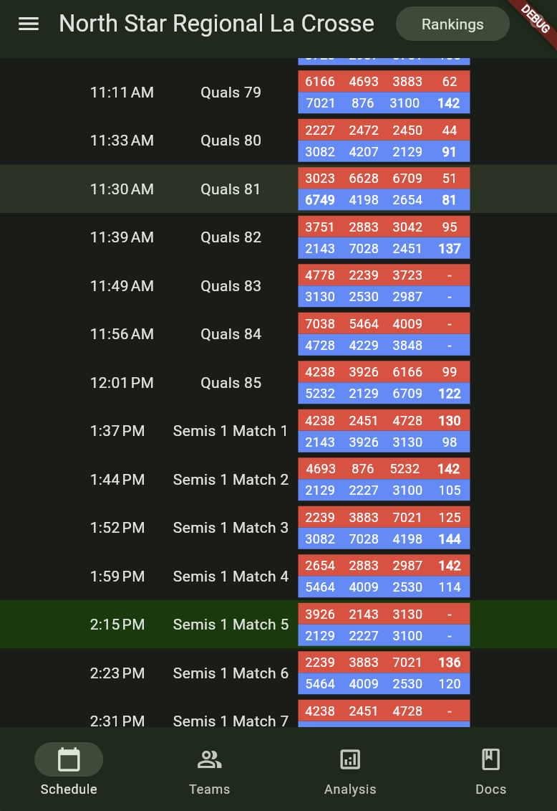
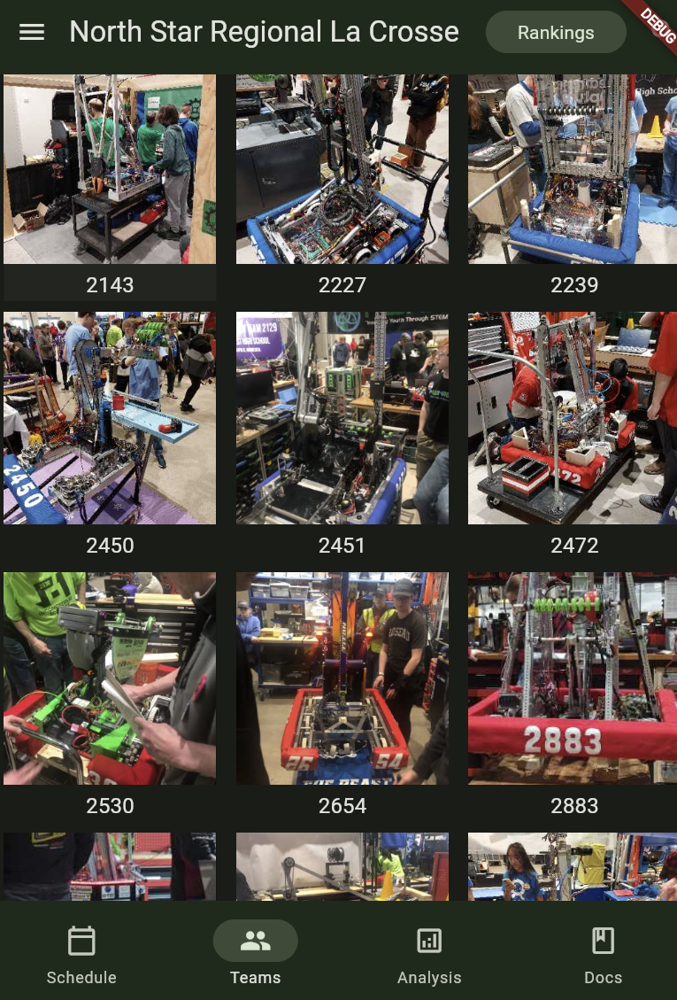
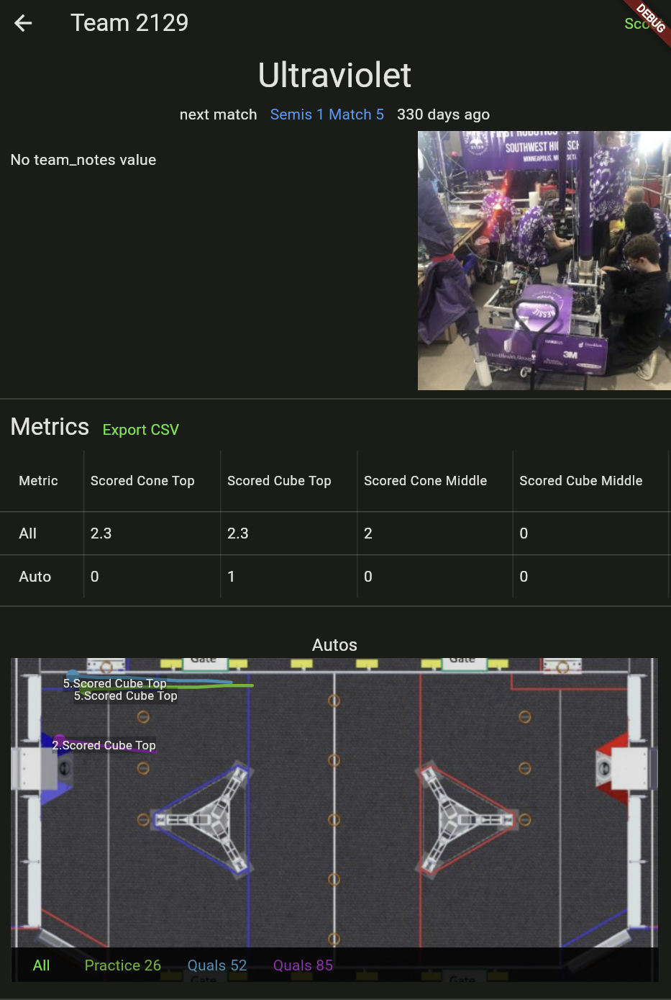
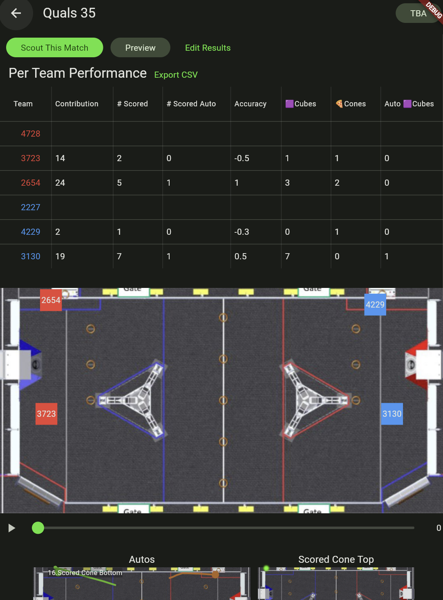
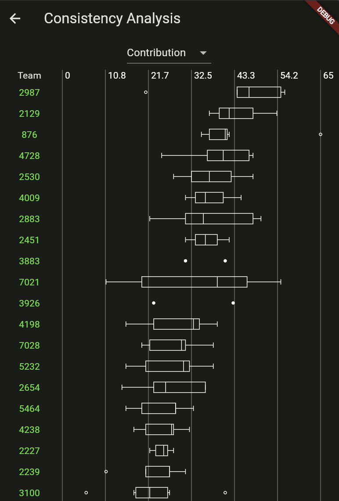
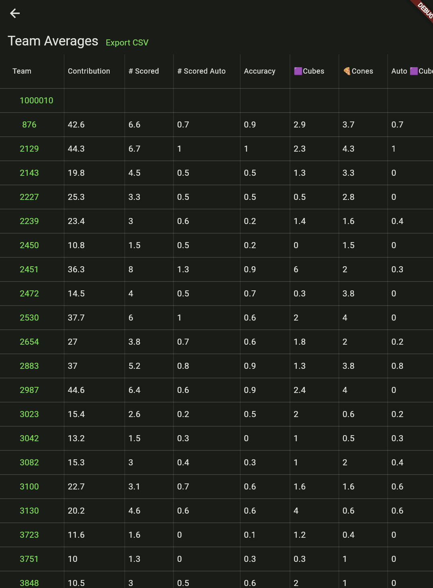

# Docs
[scouting](scouting.md)

[config_setup](config_setup.md)

[matchresultprocess](matchresultprocess.md)

# About

Snout Scout is designed to make data work for you! Created and maintained by team a 6749 alumni, it is a source available all-in-one scouting solution that easily works for any year's game with just a json config file!

## Design Goals:
- make scouting have real time impact for match planning with automated digests.
- game agnostic; the app is fully configurable using a json file.
- device agnostic; PWA first with native apps for all platforms via Flutter
- all data processing is done on client for FULL offline support
- easy export of data into multiple formats like csv and json
- responsive in low bandwidth scenarios and provide reliable low latency sync to origin
- origin handles authentication/autorizaton (TBD) and as the source of truth
- Connect to the TBA API to autofill data like event schedules and match results (including support for year specific data mapping).
- Single compact (mostly) readable data JSON file to allow for durable data. The structure is also fully typed and null safe
- strong separation between live stats (like ranking position) and facts (like scouting match data)
- no data loss
    - client saves all data locally until it can sync
    - database stores a changeset of all changes
- data anywhere. A client device can load and edit scouting data from a server or local disk for the highest possible flexibility.

## Snout-scout is NOT designed to:
- track official standings or scores directly (official scores are linked if TBA event key is provided)
- analyse multiple events at once (multiple events can be queried at the server level)
- retain compatibility with previous year data (there is no obligation for backwards compatibility)
- have **extensive** security controls. an authenticated user is assumed to be non-malicious and trusted, there is not validation of timestamps, IDs, or other information sent from clients (This is out of scope for now).

# Network/sync methodologies
## Origin on Internet - Direct
- All devices have an internet connection to an origin server
- Devices can sync anywhere
- Latency is determined by the reliability of internet at competition
- Devices with no mobile data coverage need to use a hotspot connection or only sync when internet is avaiable (this could be infrequent).
- NOTE: A hotspot device can be used to proxy the internet connection into a local area network to get results similar to Origin at Event.

## Origin at Event
- A local area network is set up at compeition and origin server is on that network.
- This is the most durable network setup but requires devices to tether to the network to update meaning higher latency.
- Only devices physically located near the origin can update with it.

# Data Size Estimate
Snout Scout stores all data in a single JSON file. Here is an approximate breakdown of the rough **DISK** size of the a database file including some of the parts. This is an estimate and real world results will vary.

for a 40 team 80 match event:
- Latest event state: ~10MB (pit scouting with 1 image; 8MB pit scouting data; 2MB match data)
- Changeset: ~15MB, a patch has minimal overhead but depends on how much data is modified
- **Disk size: 25MB**; latest state: **10MB**. to get a range of patches varies on the patch data and quantity, is porportional to how up to date the client is

- A match recording for 1 team could be as large as 4-8KB (~1KB compressed)
- Image (As compressed and sized in the app): ~80KB-160KB (small-large)

# technical philosophy
- devices will get faster
- internet connection is assumed; and at >= 50KB/s and will only get faster in the future
- use gzip and other web compression technology
- dont complicate the schema by simplifying key names to "save bandwidth", or reduce normalization for a "micro-optimization".
- the schema should be as humanly readable as possible (and easy work with)
- there is minimal need to optimize data loading other than chunking each change (splitting assets away to load optimistically; this creates a more ambiguous state. this may change in the future)

# how TBA is used
the tba api is used to automate parts of scouting; functioning as an 'autofill service'.

the current architecture involves the client device directly making api requests to
TBA. at the moment, the secret key is distributed through the event config of a scouting
file. for obvious reasons this is not ideal, since it puts secrets in a database that
eventually might have access policies or potentially gets distributed outside of a team.
this could cause a secret leak; however, i am also lazy and do not want to implement a
spearate channel to distribute the secret to client devices, ideally the server distributes
the tba api key (the server cannot proxy because the client must be able to do all functions without a server).
encryption may be used in the future

# Example images (as of Feb 2024)

